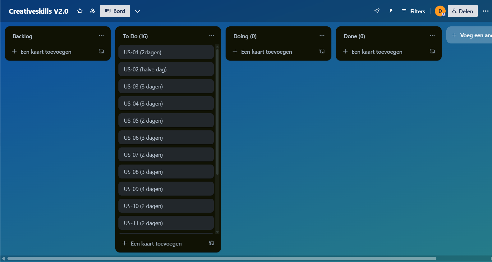
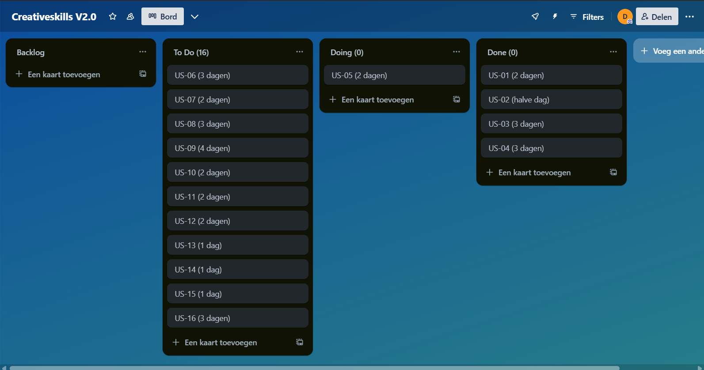
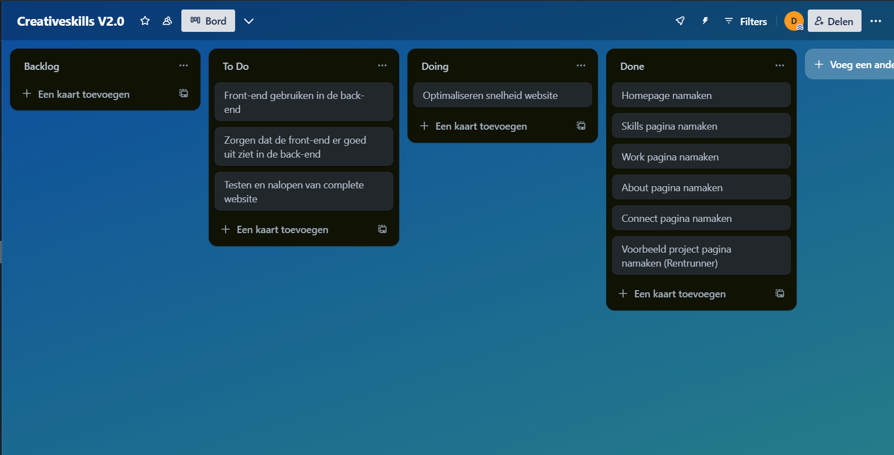
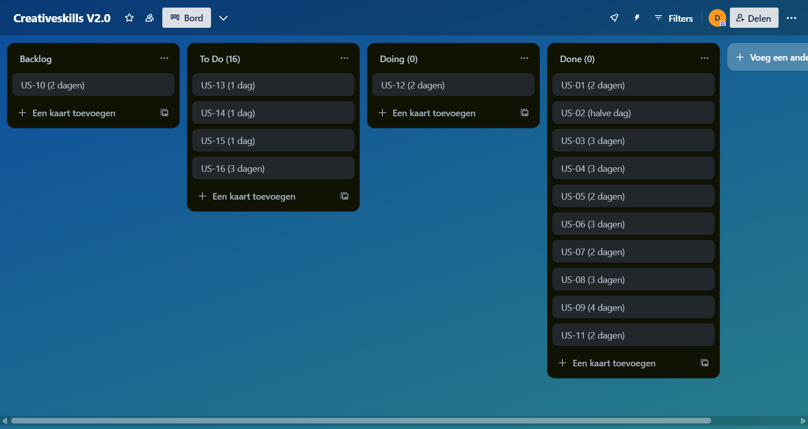
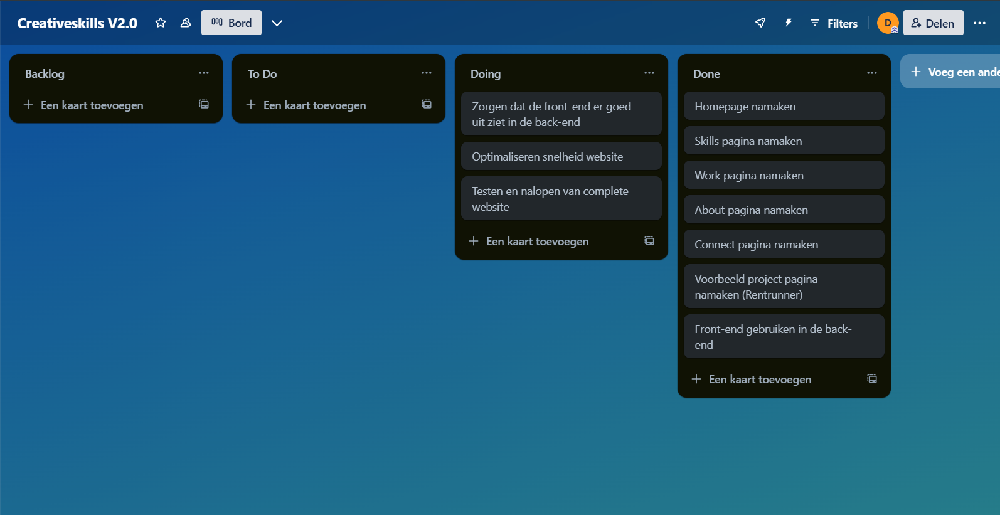
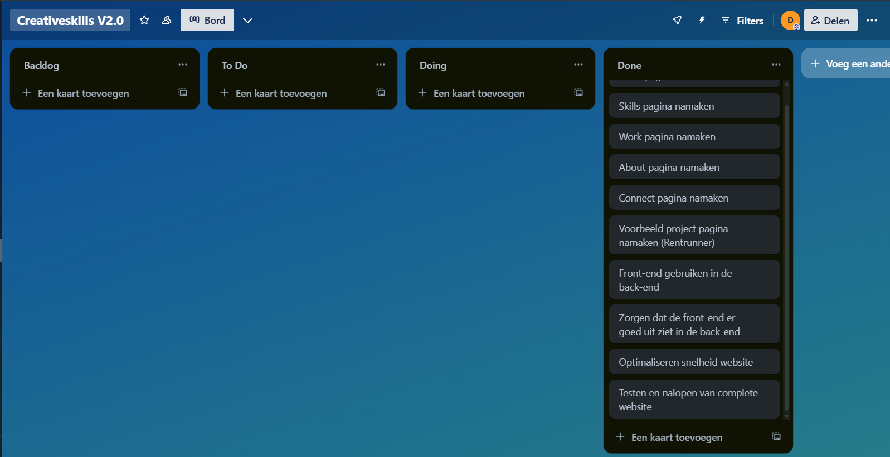

# Opdracht 1: Plant de werkzaamheden en bewaakt de voortgang

---

## **Informatie over het project**

**Naam opdrachtgever:** Erik  
**Afdeling:** Web Development  
**Project manager:** Erik  
**Teamlead development:** Erik  
**Teamleden development:** Duncan, Erik, Stefan, Stefan  
**Naam project:** Website Creative Skills

---

## **Introductie**
Dit project richt zich op het ontwikkelen van een moderne en gebruiksvriendelijke website voor de website van Creative Skills. De website moet visueel aantrekkelijk zijn, snel laden, mobielvriendelijk zijn en eenvoudig te beheren. Zowel de eindgebruiker (bezoekers) als de beheerder staan centraal in de ontwerp- en ontwikkelfase.

Het team bestaat uit meerdere developers met als doel het bouwen van een schaalbare en toekomstbestendige website. Gedurende het project wordt met wekelijkse evaluatiemomenten en sprints. De werkzaamheden worden gepland en opgevolgd aan de hand van user stories.

---

## **Projectdoel**
Het doel van dit project is om een website te realiseren die:
- Er professioneel uitziet en consistent is met het ontwerp;
- Goed functioneert op alle apparaten;
- Snel en toegankelijk is voor alle gebruikers;
- Eenvoudig aan te passen is door beheerders via het CMS-structuur.

Door dit alles te realiseren, draagt het project bij aan een positieve gebruikerservaring, verhoogde betrokkenheid en efficiënt beheer van content.

---

## **De gebruikte technieken**
Tijdens de ontwikkeling van de website zullen verschillende moderne webtechnologieën worden ingezet, waaronder:

- **HTML/CSS & JavaScript**: voor de basisstructuur en interactie.
- **Laravel Blade**: voor het bouwen van herbruikbare componenten.
- **Tailwind CSS**: voor gestroomlijnde styling.
- **Git/GitHub**: voor versiebeheer.
- **CMS-integratie**: om content eenvoudig aan te kunnen passen.
- **Optimalisatietools**: om prestaties te monitoren en te verbeteren.

---

## **User stories**
| US-id | Wie | Wat | Waarom | Realistisch | Tijdsindicatie | Prioriteit |
|-------|-----|-----|--------|-------------|----------------|------------|
| US-01 | Als beheerder | Wil ik herbruikbare componenten kunnen ontwikkelen | Zodat ik sneller en consistenter te werk kan gaan tijdens het maken van de website | Dit is realistisch en maakt het ontwikkelproces efficiënter. Het draagt ook bij aan een sterk design op de website omdat er een herkenbaar patroon in zit | Week 1-2 (Tijdens het begin van de front-end defelopment) | Gemiddeld |
| US-02 | Als bezoeker | Wil ik dat de website er netjes uitziet en overeenkomt met het ontwerp | Zodat de website een duidelijke lay-out heeft en er professioneel uitziet | Dit is realistisch en een must-have. Hoe de website eruitziet en of deze goed werkt, is erg belangrijk voor de gebruiker. Dit kan ervoor zorgen dat een gebruiker langer op de website blijft, een meer vertrouwd gevoel krijgt en meer mensen aantrekt | week 1–8 (Gedurende het hele project) | Hoog |
| US-03 | Als (mobiele) bezoeker | Wil ik dat de website er strak uitziet en goed functioneert op mijn smartphone | Zodat ik prettig door de website kan navigeren zonder horizontaal te moeten scrollen of in en uit te zoomen om iets goed te kunnen zien | Dit is realistisch en tegenwoordig heel belangrijk, aangezien veel mensen websites via hun telefoon bezoeken | week 1–8 (Gedurende het hele project) | Hoog |
| US-04 | Als bezoeker | Wil ik dat de website snel laadt, ongeacht het apparaat | Zodat ik niet hoef te wachten en direct kan zien wat ik zoek | Dit is realistisch en erg belangrijk. Als de website traag is, kan dit ervoor zorgen dat de bezoeker snel afhaakt en de website verlaat | Week 5–8 (tijdens de back-end ontwikkeling) | Gemiddeld |
| US-05 | Als beheerder | Wil ik dat de inhoud van de website duidelijk en gemakkelijk kan worden aangepast en toegevoegd wanneer dat nodig is | Zodat ik de aanpassingen snel en efficiënt kan doorvoeren op de website | Dit is realistisch en daarnaast ook erg belangrijk voor dit project, omdat anders de inhoud niet makkelijk gewijzigd kan worden. Dit is een hoge prioriteit, maar kan pas later worden gedaan aangezien de inhoud eerst aangemaakt moet worden | Week 5–8 (na het opzetten van de basisstructuur) | Hoog |

---

## **Planning van dit project**
Tijdens het project is er gewerkt met de scrum-methode. In totaal zijn er vier sprints uitgevoerd, elk met een duur van twee weken. Voorafgaand aan het project hebben we een scrumboard opgesteld waarin de globale indeling en taken per sprint zijn bepaald. Hieronder worden de vier sprints kort toegelicht, inclusief een afsluitende terugblik met het eindbord.

| Sprint 1 | Sprint 2 | Sprint 3 | Sprint 4 |
| -------- | -------- | -------- | -------- |
| US-01 | US-02 | US-02 | US-02 |
| US-02 | US-03 | US-03 | US-03 |
| US-03 |  | US-04 | US-04 |
|  |  | US-05 | US-05 |

### **Vooraf – Scrumboard Planning**

Aan het begin van het project is het scrumboard ingevuld met een initiële taakverdeling over de sprints. Hierbij hebben we de belangrijkste features en prioriteiten verdeeld, met een logische volgorde van front-end naar back-end, en daarna contentbeheer.

---

### **Sprint 1: Opzet en structuur**

In de eerste sprint lag de focus op het opzetten van de projectstructuur, het inrichten van de ontwikkelomgeving, en het ontwikkelen van de eerste herbruikbare componenten. Ook is gestart met de implementatie van de basisstyling en mobile responsiveness.

---

### **Sprint 2: Front-end uitbreiding**

Tijdens sprint 2 zijn we verder gegaan met het uitwerken van de visuele componenten. De layout is verfijnd volgens het ontwerp, en de mobiele versie van de site is verder geoptimaliseerd. Verschillende pagina's zijn uitgewerkt met behulp van de herbruikbare componenten uit sprint 1.

---

### **Sprint 3: Back-end en contentbeheer**

In sprint 3 is de focus verschoven naar de back-end: er is gewerkt aan het opzetten van het content management systeem (CMS) en de eerste connecties zijn gelegd tussen front-end en back-end. Ook zijn tests uitgevoerd op de laadtijd en performance van de website.

---

### **Sprint 4: Optimalisatie en afronding**

De laatste sprint stond in het teken van afronding en optimalisatie. Feedbackmomenten zijn verwerkt, laadtijden zijn verbeterd en het beheer van content is vereenvoudigd. Ook is er gezorgd voor een responsive eindresultaat dat op verschillende apparaten getest is.

---

### **Na afloop – Eindbord**

Na de laatste sprint zijn alle taken geverifieerd en afgerond. Het eindbord laat zien dat de belangrijkste user stories succesvol zijn geïmplementeerd. Er is ook ruimte geweest voor het verwerken van feedback en het uitvoeren van tests. Het project is binnen de gestelde tijd afgerond.