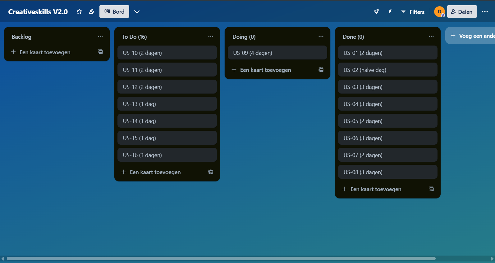

# Opdracht 1: Plant de werkzaamheden en bewaakt de voortgang

## **Informatie over het project**

**Opdrachtgever:** Creative skills  
**Afdeling:** Web Development  
**Project manager:** Erik  
**Teamlead development:** Erik  
**Teamleden development:** Duncan, Erik, Stefan, Stefan  
**Naam project:** Website Creative Skills

---

## **Introductie**
Dit project richt zich op het ontwikkelen van een moderne en gebruiksvriendelijke website voor de website van Creative Skills. De website moet visueel aantrekkelijk zijn, snel laden, mobielvriendelijk zijn en eenvoudig te beheren. Zowel de eindgebruiker als de beheerder staan centraal in de ontwerp- en ontwikkelfase.

Het team bestaat uit meerdere developers met als doel het bouwen van een schaalbare en toekomstbestendige website. Gedurende het project wordt met wekelijkse evaluatiemomenten en sprints. De werkzaamheden worden gepland en opgevolgd aan de hand van user stories.

---

## **Projectdoel**
Het doel van dit project is om een website te realiseren die:
- Er professioneel uitziet en consistent is met het ontwerp;
- Goed functioneert op alle apparaten;
- Snel en toegankelijk is voor alle gebruikers;
- Eenvoudig aan te passen is door beheerders via het CMS-structuur.

Door dit alles te realiseren, draagt het project bij aan een positieve gebruikerservaring, verhoogde betrokkenheid en efficiënt beheer van content.

---

## **Definition of done**

Dit zijn de criterea die ik na loop om te kijken of mijn werk voldoet aan de definition of done.
### 1. Functionele eisen
- De functionaliteit voldoet aan de specificaties in de user story.
- Alle taken in verband met de user story zijn afgerond.

### 2. Codekwaliteit
- De code is leesbaar en goed gestructureerd.
- De code is gereviewd door een collega en goedgekeurd.
- Geen onnodige console.logs of dode code zijn aanwezig.
- Minimale afwijking van het design (UI is minimaal 95% hetzelfde als het gemaakte ontwerp).

### 3. Responsiviteit en Browsercompatibiliteit
- De website is volledig responsive en getest op schermformaten van 360px tot 2000px.
- De website ziet er hetzelfde uit op Chrome, Safari en Firefox.

---

## **De gebruikte technieken**
Tijdens de ontwikkeling van de website zullen verschillende moderne webtechnologieën worden ingezet, waaronder:

- **HTML/CSS & JavaScript**: voor de basisstructuur en interactie.
- **Laravel Blade**: voor het bouwen van herbruikbare componenten.
- **Tailwind CSS**: voor gestroomlijnde styling.
- **Git/GitHub**: voor versiebeheer.
- **CMS-integratie**: om content eenvoudig aan te kunnen passen.
- **Optimalisatietools**: om prestaties te monitoren en te verbeteren.

---

## **User stories**
| US-id | Wie | Wat | Waarom | Realistisch | Acceptatiecriterea | Tijdsindicatie | Prioriteit |
|-------|-----|-----|--------|-------------|---------------------|----------------|------------|
| US-01 | Als beheerder | Wil ik een herbruikbaar licht thema content blok ontwikkelen | Zodat ik dat content blok snel toe kan voegen aan de pagina en dat de layout van de pagina er consistent uit blijft zien | Dit is realistisch en maakt het ontwikkelproces efficiënter. Het draagt ook bij aan een sterk design op de website omdat er een herkenbaar patroon in zit | Het contentblok moet eenvoudig te gebruiken zijn, waarbij de beheerder alleen de content hoeft in te voeren, en de opmaak automatisch overeenkomt met het bestaande design van de website. Het contentblok moet responsive zijn en zich aanpassen aan verschillende schermformaten. Het contentblok moet eenvoudig en gebruiksvriendelijk zijn, zodat een beheerder het moeiteloos kan toevoegen en aanpassen, zelfs zonder technische vaardigheden.| 2 dagen | Gemiddeld |
| US-02 | Als beheerder | Wil ik een herbruikbaar foto blok ontwikkelen | Zodat ik dat foto blok snel toe kan voegen aan de pagina en dat de layout van de pagina er consistent uit blijft zien | Dit is realistisch en maakt het ontwikkelproces efficiënter. Het draagt ook bij aan een sterk design op de website omdat er een herkenbaar patroon in zit | Het foto blok moet eenvoudig te gebruiken zijn, waarbij de beheerder alleen de foto hoeft up te loaden, en de opmaak automatisch overeenkomt met het bestaande design van de website. Het foto blok moet responsive zijn en zich aanpassen aan verschillende schermformaten. Het foto blok moet eenvoudig en gebruiksvriendelijk zijn, zodat een beheerder het moeiteloos kan toevoegen en aanpassen, zelfs zonder technische vaardigheden.| halve dag | Gemiddeld |
| US-03 | Als bezoeker | Wil ik dat de homepage er aantrekkelijk en overzichtelijk uit ziet | Zodat ik snel kan begrijpen waar de website over gaat en eenvoudig kan navigeren | Dit is realistisch en een must-have. De homepage is waarschijnlijk de eerste pagina waar de bezoeker terecht komt, als deze niet goed is kan dat er voor zorgen dat de bezoeker sneller afhaakt | De homepage moet overeen komen met het design wat gemaakt is. Ook moet het een responsief ontwerp hebben dat op alle apparaten correct wordt weergegeven.| 3 dagen | Hoog |
| US-04 | Als bezoeker | Wil ik dat de Skills pagina er aantrekkelijk en overzichtelijk uit ziet | Zodat ik snel kan begrijpen waar de pagina over gaat en eenvoudig kan navigeren | Dit is realistisch. De Skills pagina verteld wat er gebeurd binnen het bedrijf en wat ze voor je kunnen doen. | De Skills pagina moet overeen komen met het design wat gemaakt is. Ook moet het een responsief ontwerp hebben dat op alle apparaten correct wordt weergegeven.| 3 dagen | Hoog |
| US-05 | Als bezoeker | Wil ik dat de Work pagina er aantrekkelijk en overzichtelijk uit ziet | Zodat ik snel kan begrijpen waar de pagina over gaat en eenvoudig kan navigeren | Dit is realistisch. De Work pagina laat zien wat voor eerder werk er al is gemaakt met andere klanten en is belangrijk om indruk te maken op eventuele nieuwe klanten | De Work pagina moet overeen komen met het design wat gemaakt is. Ook moet het een responsief ontwerp hebben dat op alle apparaten correct wordt weergegeven.| 2 dagen | Hoog |
| US-06 | Als bezoeker | Wil ik dat de About pagina er aantrekkelijk en overzichtelijk uit ziet | Zodat ik snel kan begrijpen waar de pagina over gaat en eenvoudig kan navigeren | Dit is realistisch. De About pagina verteld wat voor technieken er gebruikt worden binnen het bedrijf en verteld je wat over de mensen die er werken | De About pagina moet overeen komen met het design wat gemaakt is. Ook moet het een responsief ontwerp hebben dat op alle apparaten correct wordt weergegeven.| 3 dagen | Hoog |
| US-07 | Als bezoeker | Wil ik dat de Connect pagina er aantrekkelijk en overzichtelijk uit ziet | Zodat ik snel kan begrijpen waar de pagina over gaat en eenvoudig kan navigeren | Dit is realistisch. De Connect pagina is een korte omschrijving wanneer je contact moet leggen met het bedrijf | De Connect pagina moet overeen komen met het design wat gemaakt is. Ook moet het een responsief ontwerp hebben dat op alle apparaten correct wordt weergegeven.| 2 dagen | Hoog |
| US-08 | Als bezoeker | Wil ik dat het project pagina template er aantrekkelijk en overzichtelijk uit zien | Zodat ik snel kan begrijpen waar het project over gaat en overzichtelijk uit ziet | Dit is realistisch. Het project pagina template zorgt er voor dat de informatie van een bepaald project makkelijk ingevuld kan worden | De template pagina moet overeen komen met het design wat gemaakt is. Ook moet het een responsief ontwerp hebben dat op alle apparaten correct wordt weergegeven.| 3 dagen | Hoog |
| US-09 | Als (mobiele) bezoeker | Wil ik dat de website er strak uitziet en goed functioneert op mijn smartphone | Zodat ik prettig door de website kan navigeren zonder horizontaal te moeten scrollen of in en uit te zoomen om iets goed te kunnen zien | Dit is realistisch en tegenwoordig heel belangrijk, aangezien veel mensen websites via hun telefoon bezoeken | De mobiele versie moet overeen komen met het design wat gemaakt is. | 4 dagen | Hoog |
| US-10 | Als bezoeker | Wil ik dat de website snel laadt, ongeacht het apparaat | Zodat ik niet hoef te wachten en direct kan zien wat ik zoek | Dit is realistisch en erg belangrijk. Als de website traag is, kan dit ervoor zorgen dat de bezoeker snel afhaakt en de website verlaat | De website moet een preformance score van 90 of hoger hebben als je hem test met lighthouse | 2 dagen | Gemiddeld |
| US-11 | Als beheerder | Wil ik dat de Homepage in de back-end word verwerkt en de inhoud word gekoppeld aan het CMS | Zodat ik de inhoud voor de pagina in kan vullen in de input velden in het CMS en dat de inhoud op de pagina terecht komt | Dit is realistisch en daarnaast ook erg belangrijk voor dit project, het marketing team zal een groot deel van de informatie toevoegen aan de pagina of in de toekomst moeten veranderen. Dit is een hoge prioriteit, maar kan pas later worden gedaan aangezien de inhoud eerst aangemaakt moet worden | De gebuiker moet in het CMS makkelijk informatie kunnen veranderen en opslaan. Als dit gedaan is zal de gewijzigde informatie toegevoegd worden aan de pagina | 2 dagen | Hoog |
| US-12 | Als beheerder | Wil ik dat de Skills in de back-end word verwerkt en de inhoud word gekoppeld aan het CMS | Zodat ik de inhoud voor de pagina in kan vullen in de input velden in het CMS en dat de inhoud op de pagina terecht komt | Dit is realistisch en daarnaast ook erg belangrijk voor dit project, het marketing team zal een groot deel van de informatie toevoegen aan de pagina of in de toekomst moeten veranderen. Dit is een hoge prioriteit, maar kan pas later worden gedaan aangezien de inhoud eerst aangemaakt moet worden | De gebuiker moet in het CMS makkelijk informatie kunnen veranderen en opslaan. Als dit gedaan is zal de gewijzigde informatie toegevoegd worden aan de pagina | 2 dagen | Hoog |
| US-13 | Als beheerder | Wil ik dat de Work in de back-end word verwerkt en de inhoud word gekoppeld aan het CMS | Zodat ik de inhoud voor de pagina in kan vullen in de input velden in het CMS en dat de inhoud op de pagina terecht komt | Dit is realistisch en daarnaast ook erg belangrijk voor dit project, het marketing team zal een groot deel van de informatie toevoegen aan de pagina of in de toekomst moeten veranderen. Dit is een hoge prioriteit, maar kan pas later worden gedaan aangezien de inhoud eerst aangemaakt moet worden | De gebuiker moet in het CMS makkelijk informatie kunnen veranderen en opslaan. Als dit gedaan is zal de gewijzigde informatie toegevoegd worden aan de pagina | 1 dag | Hoog |
| US-14 | Als beheerder | Wil ik dat de About in de back-end word verwerkt en de inhoud word gekoppeld aan het CMS | Zodat ik de inhoud voor de pagina in kan vullen in de input velden in het CMS en dat de inhoud op de pagina terecht komt | Dit is realistisch en daarnaast ook erg belangrijk voor dit project, het marketing team zal een groot deel van de informatie toevoegen aan de pagina of in de toekomst moeten veranderen. Dit is een hoge prioriteit, maar kan pas later worden gedaan aangezien de inhoud eerst aangemaakt moet worden | De gebuiker moet in het CMS makkelijk informatie kunnen veranderen en opslaan. Als dit gedaan is zal de gewijzigde informatie toegevoegd worden aan de pagina | 1 dagen | Hoog |
| US-15 | Als beheerder | Wil ik dat de Connect in de back-end word verwerkt en de inhoud word gekoppeld aan het CMS | Zodat ik de inhoud voor de pagina in kan vullen in de input velden in het CMS en dat de inhoud op de pagina terecht komt | Dit is realistisch en daarnaast ook erg belangrijk voor dit project, het marketing team zal een groot deel van de informatie toevoegen aan de pagina of in de toekomst moeten veranderen. Dit is een hoge prioriteit, maar kan pas later worden gedaan aangezien de inhoud eerst aangemaakt moet worden | De gebuiker moet in het CMS makkelijk informatie kunnen veranderen en opslaan. Als dit gedaan is zal de gewijzigde informatie toegevoegd worden aan de pagina | 1 dagen | Hoog |
| US-16 | Als beheerder | Wil ik dat de project pagina template in de back-end word verwerkt en de inhoud word gekoppeld aan het CMS | Zodat ik de inhoud voor de pagina's in kan vullen in de input velden in het CMS en dat de inhoud op de pagina terecht komt | Dit is realistisch en daarnaast ook erg belangrijk voor dit project, het marketing team zal een groot deel van de informatie toevoegen aan de pagina's of in de toekomst moeten veranderen. Dit is een hoge prioriteit, maar kan pas later worden gedaan aangezien de inhoud eerst aangemaakt moet worden | De gebuiker moet in het CMS makkelijk informatie kunnen veranderen en opslaan. Als dit gedaan is zal de gewijzigde informatie toegevoegd worden aan de pagina | 3 dagen | Hoog |

---

## **Planning van dit project**
Tijdens het project is er gewerkt met de scrum-methode. In totaal zijn er vier sprints uitgevoerd, elk met een duur van twee weken. Voorafgaand aan het project hebben we een scrumboard opgesteld waarin de globale indeling en taken per sprint zijn bepaald. Hieronder worden de vier sprints kort toegelicht, inclusief een afsluitende terugblik met het eindbord.

| Sprint 1 | Sprint 2 | Sprint 3 | Sprint 4 |
| -------- | -------- | -------- | -------- |
| US-01 | US-06 | US-02 | US-13 |
| US-03 | US-07 | US-10 | US-14 |
| US-04 | US-08 | US-11 | US-15 |
| US-05 | US-09 | US-12 | US-16 |

### **Vooraf – Scrumboard Planning**

Aan het begin van het project is het scrumboard ingevuld met een initiële taakverdeling over de sprints. Hierbij hebben we de belangrijkste features en prioriteiten verdeeld, met een logische volgorde van front-end naar back-end, en daarna contentbeheer.

---

### **Sprint 1: Opzet en structuur**

In de eerste sprint lag de focus op het opzetten van de projectstructuur, het inrichten van de ontwikkelomgeving, en het ontwikkelen van de eerste componenten. Ook is gestart met de implementatie van de basisstyling en mobile responsiveness.

---

### **Sprint 2: Front-end uitbreiding**

Tijdens sprint 2 zijn we verder gegaan met het uitwerken van de visuele componenten. De layout is verfijnd volgens het ontwerp, en de mobiele versie van de site is verder geoptimaliseerd. Alle pagina's zijn uitgewerkt met behulp van de herbruikbare componenten uit sprint 1.

---

### **Sprint 3: Back-end en contentbeheer**

In sprint 3 is de focus verschoven naar de back-end: er is gewerkt aan het opzetten van het content management systeem (CMS) en de eerste connecties zijn gelegd tussen front-end en back-end. Ook zijn tests uitgevoerd op de laadtijd en performance van de website.

---

### **Sprint 4: Optimalisatie en afronding**

De laatste sprint stond in het teken van afronding en optimalisatie. Feedbackmomenten zijn verwerkt, laadtijden zijn verbeterd en het beheer van content is vereenvoudigd. Ook is er gezorgd voor een responsive eindresultaat dat op verschillende apparaten getest is.

---

### **Na afloop – Eindbord**

Na de laatste sprint zijn alle taken geverifieerd en afgerond. Het eindbord laat zien dat de belangrijkste user stories succesvol zijn geïmplementeerd. Er is ook ruimte geweest voor het verwerken van feedback en het uitvoeren van tests. Het project is binnen de gestelde tijd afgerond.